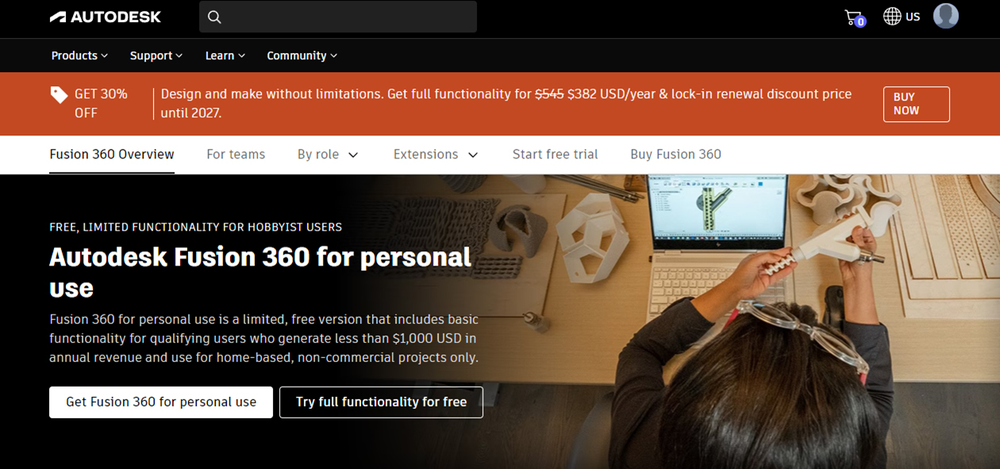
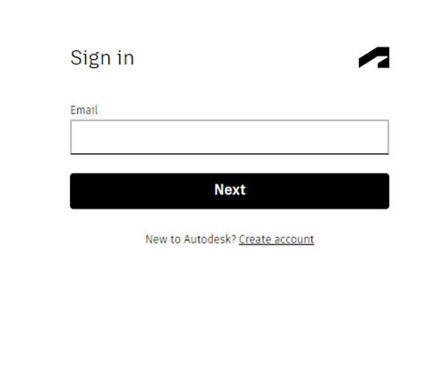
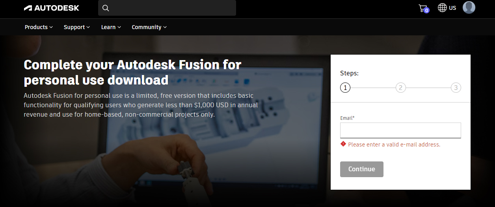
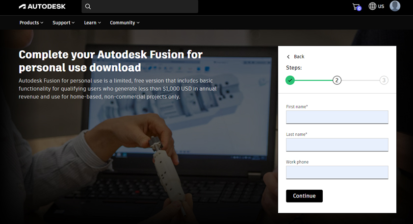
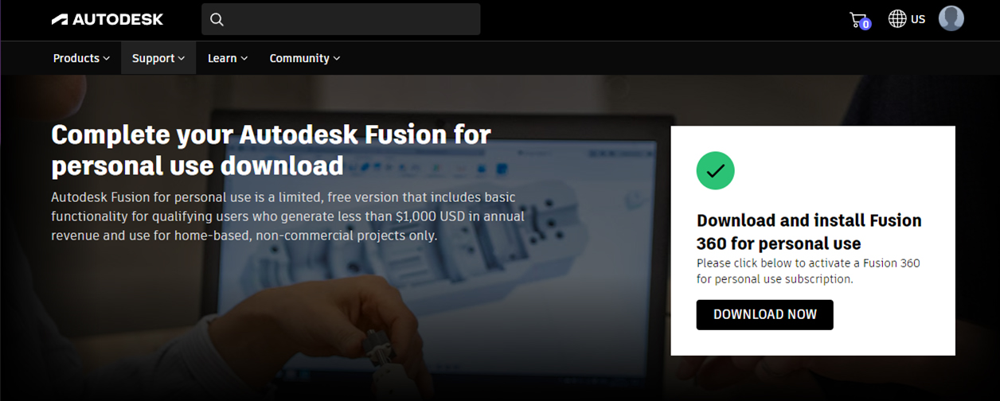

# Оформление хоббийной лицензии Fusion 360

 
 

Версия: v0.1
Дата последнего изменения: 13.01.24
Разработал: Eldar Alekperov

## Этапы
1. Страница продукта;
2. Регистрация аккаунта;
3. Внесение необходимых данных;
4. Установка ПО;

### Шаг 1
Необходимо перейти по ссылке на сайт [компании](https://www.autodesk.com/products/fusion-360/personal).

### Шаг 2
Нажать на кнопку `Get Fusion 360 for personal use` 

### Шаг 3
Если аккаунт был ранее создан, то необходимо войти в ученую запись. Иначе будет предложенно создать на новый почтовый адрес аккаунт Autodesk. После необходимо открыть почтовый клиент и подтвердить почтовый адрес перейдя по ссылке в письме.

### Шаг 4
Ввести повторно адрес электронной почты учетной записи Autodesk.

### Шаг 5
Ввести имя и фамилию пользователя, а также контактный номер телефона по примеру `+79996667744`.

### Шаг 6
Указать регион и код региона, например Австрию и ее post-code `4392`.

### Шаг 7
После всех операций будет доступна ссылка на скачивание программы.

### Шаг 7
Далее необходимо установить программу и войти в свою учетную запись.